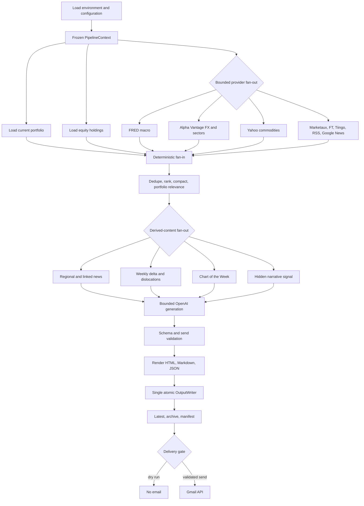

# Wolf Research Pipeline Architecture and Performance Review

## Scope

This review covers the current equity-only Weekly Market Brief. It preserves the
existing HTML design, FRED Chart of the Week, weekly delta and dislocation views,
hidden n-gram editorial signal, Gmail delivery, and all configured providers:
FRED, Alpha Vantage, Yahoo Finance, Marketaux, Financial Times, Tiingo, RSS/Google
News, Gmail digest ingestion, and OpenAI. Fixed income remains out of scope.

## Data Grain

| Dataset | Grain | Fan-out control |
|---|---|---|
| Normalized news | One row per article URL/story | Dedupe and rank before portfolio matching; raw payload fields dropped |
| Equity portfolio | One row per holding | Loaded once per run; aliases are matched against the reduced article set |
| Macro observations | One row per FRED series observation/snapshot | Aggregated by the macro fetcher before section generation |
| Market data | One row per asset and horizon | Reduced to configured instruments before rendering |
| Sector data | One row per sector per region | Region blocks remain separate; no cross-region Cartesian join |
| Newsletter sections | One object per named section | Generated only after all upstream inputs have joined deterministically |
| Artifacts | One byte payload per final file | Published by one writer to `latest` and the dated archive |

Portfolio matching never cross-joins every holding with every raw article. Direct
name/alias matching operates after deduplication and ranking; broader sector,
currency, and region rules then run only on the reduced candidates.

## Before: Current Architecture Review

The original `build_newsletter()` function was a long sequential coordinator.
It loaded configuration and portfolio files, fetched each provider in turn,
processed articles, rendered a chart, called OpenAI, rendered each format, and
wrote the same payload repeatedly to latest and archive directories.

### Principal bottlenecks and risks

- Independent FRED, market-data, news, sector, and private-market requests waited
  on one another. News providers were also called through one broad synchronous
  bundle.
- Portfolio and configuration data could be loaded in separate downstream paths.
- News objects retained provider-specific fields after ranking, increasing the
  OpenAI payload and audit footprint.
- Chart generation wrote into final output paths before the edition had passed
  validation.
- HTML, Markdown, JSON, and audit models were rebuilt or serialized repeatedly.
- Multiple modules could write into `output/latest`, exposing readers to partial
  editions and concurrent-run races.
- Provider audit data used a process-global mutable dictionary without a lock.
- Provider errors could surface late and lacked consistent stage timing, cache,
  and degradation metadata.
- A naive article-to-holding expansion could grow as `articles x holdings`; the
  implemented flow now filters first and keeps one article as the primary grain.

### Work classification

I/O-bound work includes provider HTTP requests, RSS/Gmail ingestion, local file
reads and writes, OpenAI calls, external assets, and email delivery. CPU-bound
work includes deduplication/ranking, portfolio matching, return calculations,
chart rendering, image/PDF work, and final serialization.

## After: DAG Architecture

`src.pipeline.orchestrator` now owns a deterministic DAG:



1. **Context**: load `.env`, configuration, performance policy, run ID, and a
   temporary run directory once into a frozen `PipelineContext`.
2. **Initial fan-out**: load the current portfolio and equity holdings in parallel.
3. **Provider fan-out**: run news, private markets, FRED, FX, commodities, and
   sectors concurrently with a total semaphore plus provider semaphores.
4. **Provider fan-in**: convert every success or exception into an immutable
   `ProviderResult`; a failed provider contributes a bounded fallback and warning.
5. **Article processing**: dedupe, rank, enrich for portfolio relevance, and remove
   raw provider fields before any portfolio-linked fan-out or OpenAI call.
6. **Derived fan-out**: build linked news, regional headlines, watchlist,
   narrative signal, and Chart of the Week concurrently from compact inputs.
7. **Generation fan-in**: calculate weekly deltas/dislocations, then make the one
   bounded OpenAI section-generation call.
8. **Validation**: assemble the complete newsletter and apply production-send
   gates. Gmail sending remains after successful artifact publication.
9. **Publication**: `OutputWriter` atomically writes finalized artifacts to latest
   and archive directories, emits SHA-256 checksums in `manifest.json`, and then
   removes only the verified temporary run directory.

The existing synchronous provider implementations run through a bounded shared
thread pool, keeping blocking calls off the event loop without changing provider
semantics. `AsyncProviderClient` supplies pooled native `httpx` primitives for the
incremental migration of FRED, Alpha Vantage, Marketaux, RSS, and asset fetchers.

## Before vs After

| Area | Current issue | Proposed/implemented fix | Expected impact | Risk/trade-off |
|---|---|---|---|---|
| External fetches | Independent providers sequential | Bounded `asyncio.gather` plus shared executor | Latency approaches slowest bundle, not sum | Provider internals can still be sequential |
| Rate limits | Provider behavior spread across fetchers | Total and per-provider semaphores; timeout/retry policy in async client | Lower quota and saturation risk | Conservative limits can increase latency |
| Failure handling | One exception could interrupt the run | `ProviderResult` fallback with structured errors | Partial provider outage still yields an auditable edition | Send validation may still block degraded editions |
| State | Large mutable dictionaries and global audit | Frozen context/results; lock-protected legacy audit bridge | Deterministic merging and safer concurrency | Legacy audit remains until fetchers accept injected collectors |
| News grain | Raw records retained too long | Dedupe/rank before matching; compact allowlist | Smaller LLM and memory footprint | New fields must be added to the allowlist deliberately |
| CPU work | Shared with coordinator thread | Vectorization first; bounded worker abstraction | Keeps event loop responsive | Process start/serialization can cost more than it saves |
| Cache | Repeated successful requests | Per-provider bounded TTL cache with secret rejection | Faster warm runs and fewer calls | Provider licensing can disable persistence |
| Rendering | Repeated assembly/serialization | Assemble once and create compact artifacts once | Less CPU and object churn | Final pretty JSON remains intentionally larger |
| Output | Many direct writes | Single lock-protected atomic writer | No partially replaced file; deterministic archive | Lock serializes publishers in one process |
| Observability | Sparse provider counters | Stage/provider timing, memory, cache, worker, error metrics | Faster diagnosis and capacity planning | `tracemalloc` adds small measurement overhead |
| Artifacts | No edition-level integrity record | Manifest with files, sizes, checksums, status, duration | Easy handover and automation verification | Manifest describes finalized payloads, not email transport |

## Concurrency and Synchronization

- `max_total_io_concurrency` bounds the entire fetch fan-out.
- Each provider has its own semaphore and timeout/retry policy.
- `ThreadPoolExecutor` wraps blocking provider libraries; no blocking network work
  runs directly on the event loop.
- OpenAI is explicitly semaphore-bounded. The current generation contract makes
  one structured call, so parallel LLM fan-out would add complexity without gain.
- Cache locks are per provider and held only for local read/replace/prune work.
- Provider audit mutation is lock-protected as a compatibility boundary.
- Final publication has a short single-writer lock; network and rendering work is
  complete before the lock is acquired.

## Memory and Serialization

- Article normalization retains only fields consumed by ranking, linking,
  generation, and rendering; full API payloads never enter final newsletter JSON.
- `optimize_dataframe_memory()` downcasts numeric columns and categorizes repeated
  region, category, source, sector, and currency strings when pandas is used.
- CSV helpers support `usecols` and dtype hints.
- Internal cache JSON is compact; only final human-facing JSON is indented.
- Caches are bounded per provider and include TTL/source-window keys.
- Audit logs contain counts, identifiers, timings, and errors rather than payloads.

## Intentionally Sequential Work

- Alpha Vantage symbol loops inside a provider bundle remain conservative because
  the free tier is request-rate constrained. Cross-provider concurrency supplies
  most of the safe latency win.
- Marketaux/Tiingo/RSS source logic inside the news bundle retains its early-stop,
  quota, licensing, and normalization behavior. Native async migration can occur
  provider by provider behind the same `ProviderStage` contract.
- The single OpenAI structured generation call remains sequential after source
  fan-in because all selected evidence must be stable first.
- Chart rendering defaults to a thread worker. On Windows, spawning a process for
  one compact matplotlib chart and serializing its payload was judged more costly
  and fragile than the likely CPU saving. The executor supports a process pool for
  future isolated, measured workloads.
- Final publication is serialized by design to preserve edition consistency.

## Operations and Observability

Performance settings live in `config/performance.yaml`. Final audit fields include
pipeline and stage durations, provider durations/status, cache hit/miss/expiry
counts, API calls by provider, provider errors, warnings by stage, worker limits,
memory before/after/peak, and article compaction metrics. `output/latest/manifest.json`
records final artifact integrity and send status.

Use the quota-safe benchmark for routine regression checks:

```powershell
python scripts/benchmark_pipeline.py
```

### Measured August 2026 results

The first instrumented live cold run took 230.1 seconds. Its stage metrics exposed
an all-pairs fuzzy-title deduper as the dominant cost: 147.2 seconds for 308 input
articles. Exact URL/title sets, one-time normalization, token-blocked candidate
selection, and cheap `SequenceMatcher` bounds reduced article processing to 0.23
seconds in the subsequent real run. That warm run completed the measured pipeline
in 29.5 seconds with five provider-cache hits. These live numbers combine the
algorithm fix and warm-cache effect, so they should not be interpreted as a pure
cache-only comparison.

The deterministic no-quota benchmark measured 0.832 seconds sequential, 0.226
seconds for a cold concurrent run, and 0.081 seconds for a warm-cache run. That is
3.68x cold and 10.29x warm speedup for the mocked I/O workload. Results are stored
in `output/latest/performance_benchmark.json`.

Use `--live` only when a deliberate provider-backed performance measurement is
needed. Normal production verification remains:

```powershell
python -m pytest
python scripts/preview_design.py
python -m src.main
```

## Remaining Risks and Follow-up

- Convert individual synchronous fetchers to `AsyncProviderClient` incrementally;
  the orchestration contract is ready, but wholesale conversion would raise data
  correctness and provider-compliance risk in one change.
- Replace the lock-protected global provider audit bridge with an injected event
  collector once each fetcher accepts explicit dependencies.
- Add a distributed run lock or object-store compare-and-swap if multiple hosts
  publish the same edition; the current writer lock protects one Python process.
- Benchmark PDF conversion separately if it becomes part of the Monday job; it is
  currently a preview concern, not a final newsletter dependency.
- Continue tracking cache licensing, especially Tiingo persistence restrictions.
