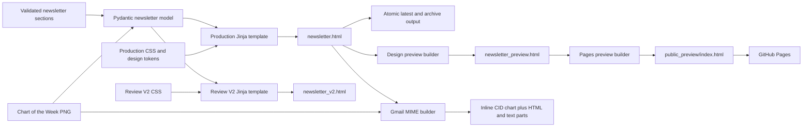

# Newsletter Design Pipeline

This document shows how structured research becomes the production email, review
variant, local preview, and GitHub Pages sample. The visual system remains
light-first, minimal, email-safe, and compatible with supported dark-mode clients.

## Render Flow

## Source Files

| Layer | Production | Review/preview |
|---|---|---|
| Structured assembly | `src/render/assemble_newsletter.py` | `src/render/review_v2.py` |
| Template | `templates/newsletter.html.j2` | `templates/newsletter_review_v2.html.j2` |
| Styles | `assets/newsletter.css` | `assets/newsletter_review_v2.css` |
| Local preview | `scripts/preview_design.py` | `scripts/preview_review_v2.py` |
| Pages packaging | `scripts/build_pages_preview.py` | `public_preview/` |
| Final publication | `src/pipeline/output_writer.py` | `output/latest/manifest.json` |

## Visual Contract

- Maximum email width remains approximately 720px.
- Production HTML uses email-safe tables, inline-compatible CSS, no JavaScript,
  no external fonts, and a light neutral canvas.
- Navy carries hierarchy, gold marks editorial emphasis, and red/green are
  reserved for negative/positive financial values.
- Numeric columns use explicit widths, right alignment, and non-wrapping values
  so Outlook does not collapse figures together.
- Headings and metadata retain sufficient light-mode contrast; supported clients
  receive dark-mode overrides through color-scheme metadata and media queries.
- The Chart of the Week is generated locally, embedded in Gmail by CID, and copied
  beside static HTML for browser and Pages previews.
- The hidden n-gram model influences story selection but is not rendered as a
  reader-facing Narrative Monitor. What Changed This Week and Dislocation Watch
  carry the useful signal into the edition.

## Reviewer Path

1. Open `output/design_preview/newsletter_preview.html` locally for the current
   full edition.
2. Open `output/review_v2/newsletter_v2.html` for the reduced design experiment.
3. Review `public_preview/index.html` in the pull request or use the deployed
   GitHub Pages URL after the Pages workflow completes.
4. Confirm `output/latest/manifest.json` checksums before approving delivery.

The Pages bundle intentionally contains only rendered HTML and the chart image.
It excludes environment files, API keys, raw provider responses, audit logs, and
portfolio source files.
